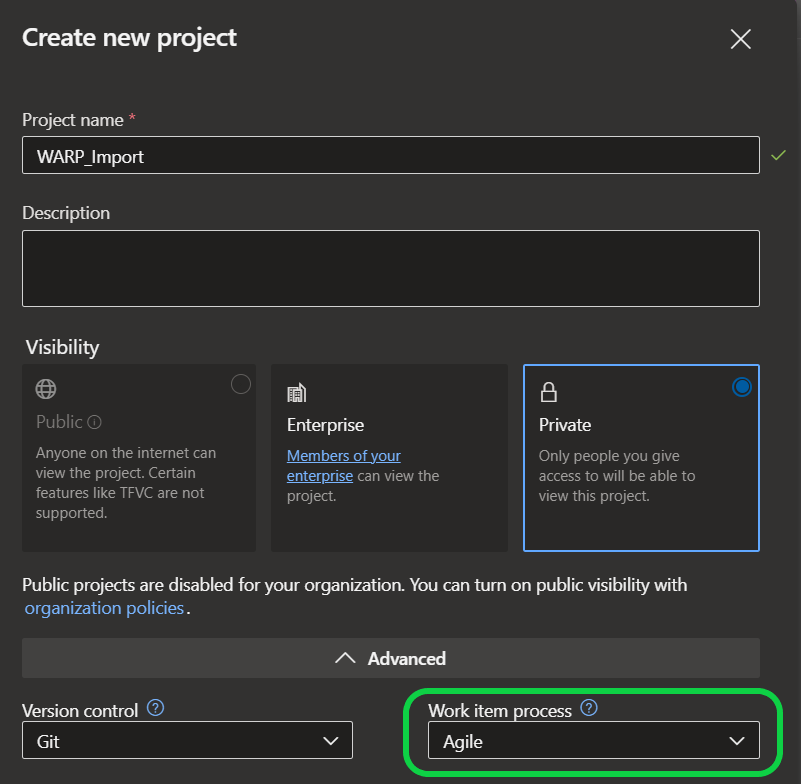
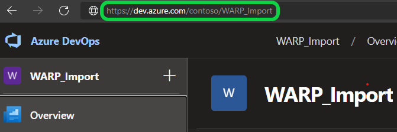

# DevOps Tooling for Well-Architected Recommendation Process

## Overview

There are four sections to this document:

1. Preparation
1. Reporting
1. Place findings into an Azure DevOps project
1. Importing to GitHub

## Preparation

### Prerequisites

- A ***new or empty*** DevOps project using an agile framework. Instructions to create this project are below.

 - We encourage users of this example script to test on a non-production DevOps project to better understand how recommendations are presented in Azure DevOps.

 - After testing, users of this example script are encouraged to import recommendations into an appropriate Azure DevOps project for work planning and execution. 

    **or**

- A ***new or empty*** GitHub repo to receive these items.

 - We encourage users of this example script to test on a non-production Github project to better understand how recommendations are presented in Github.

 - After testing, users of this example script are encouraged to import recommendations into an appropriate GitHub project for work planning and execution. 

- Windows 10 or greater.

- PowerShell v7

- Microsoft PowerPoint 2019

 - PowerPoint is not required for importing findings into Azure DevOps or Github.

 - Only required for creating PowerPoint slideshows outlining the issues found.

---

**IMPORTANT:**  **These instructions only work in a Windows environment at this time.**

### Download scripts and prepare your environment to run them.

1. Download and install [PowerShell 7](https://docs.microsoft.com/en-us/powershell/scripting/install/installing-powershell)

1. Open a PowerShell terminal and run the following commands from within a new or existing directory:

    ```powershell
    $installUri = "https://raw.githubusercontent.com/Azure/WellArchitected-Tools/main/WARP/devops/install-WARP-tools.ps1"
    Invoke-WebRequest $installUri -OutFile "install-WARP-tools.ps1"
    .\install-WARP-tools.ps1
    ```

    Example output:

    ```powershell
    PS C:\Users\cae> mkdir warp
    PS C:\Users\cae> cd warp
    PS C:\Users\cae\warp> $installUri = "https://raw.githubusercontent.com/Azure/WellArchitected-Tools/main/WARP/devops/install-WARP-tools.ps1"
    PS C:\Users\cae\warp> Invoke-WebRequest $installUri -OutFile "install-WARP-tools.ps1"
    PS C:\Users\cae\warp> .\install-WARP-tools.ps1
    Working Directory: C:\Users\cae\warp
    Downloading from: https://raw.githubusercontent.com/Azure/WellArchitected-Tools/main/WARP/devops
    We will get these files:
        Azure_Well_Architected_Review_Sample.csv
        CAF Category Descriptions.csv
        DevOps Category Descriptions.csv
        GenerateAssessmentReport.ps1
        PnP-DevOps.ps1
        PnP-Github.ps1
        PnP_PowerPointReport_Template.pptx
        PnP_PowerPointReport_Template - CloudAdoption.pptx
        PnP_PowerPointReport_Template - DevOpsCapability.pptx
        WAF Category Descriptions.csv
    ```

## Reporting

### Create a customer presentation PowerPoint deck using PowerShell

1. Copy the exported CSV from a [Microsoft Azure Well-Architected Review](https://learn.microsoft.com/en-us/assessments/) into the working directory created above.

    **NOTE:** A sample export has been included with this tooling: Azure\_Well\_Architected\_Review\_Sample.csv

1. Run the following command in the PowerShell terminal and select the CSV file you wish to use:

    ```powershell
    .\GenerateAssessmentReport.ps1 
    ```

    **NOTE:** A new PowerPoint file will be created in the directory with name in the format of: `WAF-Review-yyyy-MM-dd-HHmm.pptx`

1. Examine this PowerPoint file for auto-generated slides after slide 8.

1. If these slides are created in this deck, then your environment is properly set up and you may move now use the above steps with a CSV generated by your WAF assessment.

## Import recommendations into an Azure DevOps project

1. Create or log into an Azure DevOps **Organization**:

    - If an organization does not exist, follow these steps in this [link](https://learn.microsoft.com/en-us/azure/devops/organizations/accounts/create-organization).

    **IMPORTANT:** In Azure DevOps, under **Organization Settings - Overview**, verify that your organization is using the [new URL format](https://learn.microsoft.com/en-us/azure/devops/release-notes/2018/sep-10-azure-devops-launch#administration).

1. Navigate to the **Project** where you want to import the recommendations:
    - If a project does not exist in the Azure DevOps Organization, then create a new project using the steps in this [link](https://learn.microsoft.com/en-us/azure/devops/organizations/projects/create-project).

    **IMPORTANT:** If you are using an existing **Project**, you will need to ensure that the [process](https://learn.microsoft.com/en-us/azure/devops/organizations/settings/work/inheritance-process-model) is set to **Agile**. When you create a new project, ensure that the **Work item process** is set to **Agile** under **Advanced**. If the project is not Agile, you can change the DevOpsWorkItemType parameter to fit other work item proceses. Valid work items types are Feature or Issue.

    

1. Make note of the **Project** URL in the address bar

    

1. Create or acquire an Azure DevOps **Personal Access Token** using the steps in this [link](https://learn.microsoft.com/en-us/azure/devops/organizations/accounts/use-personal-access-tokens-to-authenticate).

    - **IMPORTANT:** The **Personal Access Token** that you use or create must have **Read, write, & manage** access to **Work Items**

    

1. Run the following command in the PowerShell terminal.

    ```powershell
    .\PnP-DevOps.ps1 -DevOpsPersonalAccessToken PAT_FROM_ADO -DevOpsProjectUri "PROJECT_URL" -DevOpsTagName -DevOpsWorkItemType { [Feature],[Issue] } "ASSESSMENT_NAME" -AssessmentCsvPath PATH_TO_CSV
    ```

    The flags are:

    * **-DevOpsPersonalAccessToken** The **Personal Access Token** from ADO
    * **-DevOpsProjectUri** The URL for your **Project**
    * **-DevOpsTagName** is used to tag the imported work items in ADO.
        * Organizations and teams can use these tags as  milestones to organize the work items across multiple assessments. 
        * For example:

            A team performs a Well-Architected Review and imports the resultant CSV into their DevOps tooling. The team names this import "Milestone 1" and all work items imported are tagged with the name "Milestone 1"
            
            After a few sprints, the team can perform another Well-Architected Review. The import the resultant CSV into their DevOps tooling. This import would be named "Milestone 2".

            Note: Assessments and imports should focus only on a single workload. There is no method to differentiate between workloads with these tools.
    * **-DevOpsWorkItemType** Set the work item type for the project. Valid options are Feature or Issue.
    * **-AssessmentCsvPath** The exported CSV file from a [Microsoft Azure Well-Architected Assessment](https://learn.microsoft.com/en-us/assessments/).
    
    
    Example command output:

    ```powershell
    PS C:\Users\cae\warp>.\PnP-DevOps.ps1 -csv .\Azure_Well_Architected_Review_Sample.csv `
    >> -DevOpsPersonalAccessToken xxxxxxxxxxxxxxxxx `
    >> -DevOpsProjectUri https://dev.azure.com/contoso/WARP_Import `
    >> -DevOpsTagName "WAF-Assessment-202201"
    Assessment Name: WAF-Assessment-202201
    URI Base: https://dev.azure.com/contoso/WARP_Import/
    Number of Recommendations to import : 175
    Ready? [y/n]: y
    Adding Epic to ADO: Operational Procedures
    Adding Epic to ADO: Deployment & Testing
    Adding Epic to ADO: Governance
    ...
    Adding Work Item: Storage account should use a private link connection for 4 Storage Account(s)
    Adding Work Item: Log Analytics agent should be installed on your virtual machine for 1 Virtual machine(s)
    Adding Work Item: Management ports of virtual machines should be protected with just-in-time network access control for 1 Virtual machine(s)
    ...

    Import Complete!
    ```

1. When the script finishes, navigate to the **Backlogs** in your Azure DevOps Projects, enable **Epics** in the settings, and then set the navigation level to **Epics**.

    

    

    
    **NOTE:** If **Epics** do not appear in the drop down after changing the settings, refreshing the page should fix that.

1. You should now see the **Backlogs** populated with **Epics** and **Features** or **Issues**:

    

## Place findings into a GitHub repository

1. Create or log into an existing Github repository.

    - If an organization does not exist, follow these steps in this [link](https://docs.github.com/en/get-started/quickstart/create-a-repo).

1. Acquire a [personal access token](https://docs.github.com/en/github/authenticating-to-github/creating-a-personal-access-token) with write access to create issues:

    - Permissions should be *Full control of private repositories*.
    

1. Run the `PnP-Github.ps1` script from a command prompt: `./PnP-Github.ps1 -GithubPersonalAccessToken \`
   `"GITHUB-PAT-TOKEN" -AssessmentCsvPath PATH-TO-CSV -GithubrepoUri "URI-FOR-GITHUB-DEPOT" -GithubTagName "ASSESSMENT_NAME"`

    The flags are:

    * **-GithubPersonalAccessToken** The **Personal Access Token** from Github
    * **-GithubrepoUri** The URL for your **Project**
    * **-AssessmentCsvPath** The exported CSV file from a [Microsoft Azure Well-Architected Assessment](https://learn.microsoft.com/en-us/assessments/).
    * **-GithubTagName** is used is used to tag the imported issues in GitHub.
        * Organizations and teams can use these tags as  milestones to organize the issues (work items) across multiple assessments.
        * For example:

            A team performs a Well-Architected Review and imports the resultant CSV into their GitHub repository. The team names this import "Milestone 1" and all issues (work items) imported are tagged with the name "Milestone 1"
            
            After a few sprints, the team can perform another Well-Architected Review. They import the resultant CSV into their GitHub repository. This import would be named "Milestone 2".

            Note: Assessments and imports should focus only on a single workload. There is no method to differentiate between workloads with these tools.
    

    Example command output:
1. Example: `./PnP-Github.ps1 -GithubPersonalAccessToken xxxxxx -GithubrepoUri "https://github.com/contoso/WAF-Review" -GithubTagName WAF-Security  -AssessmentCsvPath .\Azure_Well_Architected_Review.csv`

1.  You should see **Milestones** and **Issues** populated with data.

