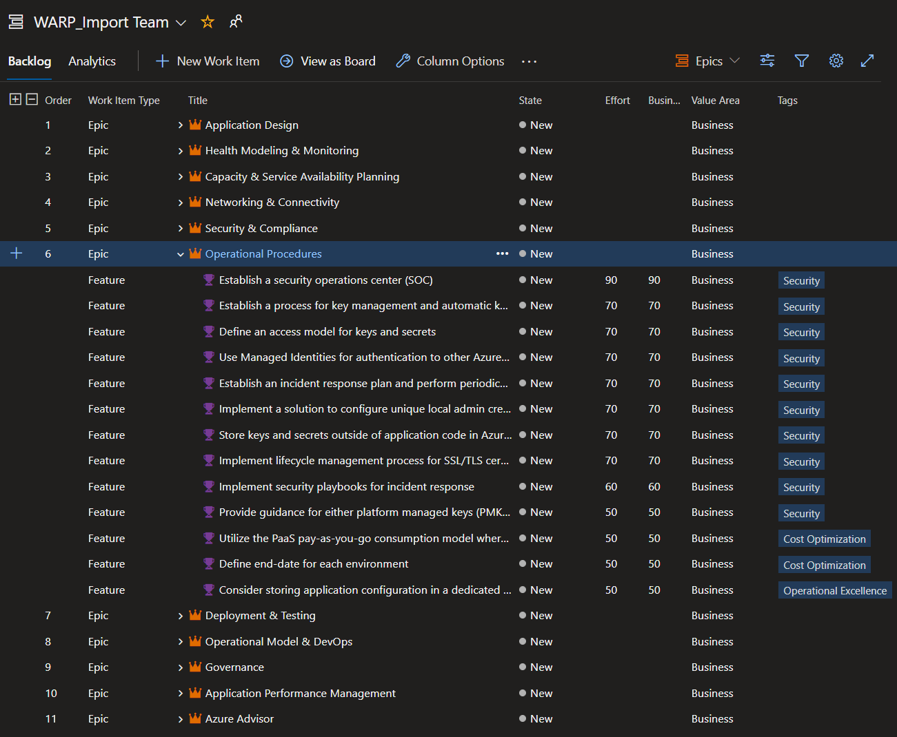

# DevOps Tooling for Well-Architected Recommendation Process

## Overview

There are four sections to this document:

1. Preparation
1. Reporting
1. Place findings into an Azure DevOps project
1. Importing to GitHub

## Preparation

### Prerequisites

- A ***new or empty*** DevOps project using an agile framework. Instructions to create this project are below.

 - We encourage users of this example script to test on a non-production DevOps project to better understand how recommendations are presented in Azure DevOps.

 - After testing, users of this example script are encouraged to import recommendations into an appropriate Azure DevOps project for work planning and execution. 

    **or**

- A ***new or empty*** GitHub repo to receive these items.

 - We encourage users of this example script to test on a non-production Github project to better understand how recommendations are presented in Github.

 - After testing, users of this example script are encouraged to import recommendations into an appropriate GitHub project for work planning and execution. 

- Windows 10 or greater.

- PowerShell v7

- Microsoft PowerPoint 2019

 - PowerPoint is not required for importing findings into Azure DevOps or Github.

 - Only required for creating PowerPoint slideshows outlining the issues found.

---

**IMPORTANT:**  **These instructions only work in a Windows environment at this time.**

### Download scripts and prepare your environment to run them.

1. Download and install [PowerShell 7](https://docs.microsoft.com/en-us/powershell/scripting/install/installing-powershell)

1. Open a PowerShell terminal and run the following commands from withing a new or existing directory:

    ```powershell
    $installUri = "https://raw.githubusercontent.com/Azure/WellArchitected-Tools/main/WARP/devops/install-WARP-tools.ps1"
    Invoke-WebRequest $installUri -OutFile "install-WARP-tools.ps1"
    .\install-WARP-tools.ps1
    ```

    Example output:

    ```powershell
    PS C:\Users\cae> mkdir warp
    PS C:\Users\cae> cd warp
    PS C:\Users\cae\warp> $installUri = "https://raw.githubusercontent.com/Azure/WellArchitected-Tools/main/WARP/devops/install-WARP-tools.ps1"
    PS C:\Users\cae\warp> Invoke-WebRequest $installUri -OutFile "install-WARP-tools.ps1"
    PS C:\Users\cae\warp> .\install-WARP-tools.ps1
    Working Directory: C:\Users\cae\warp
    Downloading from: https://raw.githubusercontent.com/Azure/WellArchitected-Tools/main/WARP/devops
    We will get these files:
       Azure_Well_Architected_Review_Feb_01_2010_8_00_00_AM.csv
       GenerateWAFReport.ps1
       PnP-DevOps.ps1
       PnP-Github.ps1
       PnP_PowerPointReport_Template.pptx
       WAF Category Descriptions.csv
       WASA.json
       keys.txt
    ```

## Reporting

### Create a customer presentation PowerPoint deck using PowerShell

1. Copy the exported CSV from a [Microsoft Azure Well-Architected Review](https://docs.microsoft.com/assessments/?mode=pre-assessment) into the working directory created above.

    **NOTE:** A sample export has been included with this tooling: Azure\_Well\_Architected\_Review\_Feb\_01\_2010\_8\_00\_00\_AM.csv

1. Run the following command in the PowerShell terminal and select the CSV file you wish to use:

    ```powershell
    .\GenerateWAFReport.ps1 
    ```

    **NOTE:** A new PowerPoint file will be created in the directory with name in the format of: `PnP_PowerPointReport_Template_mmm-dd-yyyy hh.mm.ss.pptx`

1. Examine this PowerPoint file for auto-generated slides after slide 8.

1. If these slides are created in this deck, then your environment is properly set up and you may move now use the above steps with a CSV generated by your WAF assessment.

## Import recommendations into an Azure DevOps project

1. Create or log into an Azure DevOps **Organization**:

    - If an organization does not exist, follow these steps in this [link](https://docs.microsoft.com/azure/devops/organizations/accounts/create-organization?view=azure-devops&preserve-view=true).

    **IMPORTANT:** In Azure DevOps, under **Organization Settings - Overview**, verify that your organization is using the [new URL format](https://docs.microsoft.com/en-us/azure/devops/release-notes/2018/sep-10-azure-devops-launch#administration).

1. Navigate to the **Project** where you want to import the recommendations:
    - If a project does not exist in the Azure DevOps Organization, then create a new project using the steps in this [link](https://docs.microsoft.com/azure/devops/organizations/projects/create-project?view=azure-devops&tabs=preview-page&preserve-view=true).

    **IMPORTANT:** If you are using an existing **Project**, you will need to ensure that the [process](https://docs.microsoft.com/en-us/azure/devops/organizations/settings/work/inheritance-process-model?view=azure-devops&tabs=agile-process) is set to **Agile**. When you create a new project, ensure that the **Work item process** is set to **Agile** under **Advanced**.

    

1. Make note of the **Project** URL in the address bar

    

1. Create or acquire an Azure DevOps **Personal Access Token** using the steps in this [link](https://docs.microsoft.com/azure/devops/organizations/accounts/use-personal-access-tokens-to-authenticate?view=azure-devops&tabs=preview-page&preserve-view=true).

    - **IMPORTANT:** The **Personal Access Token** that you use or create must have **Read, write, & manage** access to **Work Items**

    

1. Update **AzureDevOpsPAT** key in the `keys.txt` file with the **Personal Access Token** that you plan to use.

1. Run the following command in the PowerShell terminal, using the URL for your **Project** and select the exported CSV file from a [Microsoft Azure Well-Architected Review](https://docs.microsoft.com/assessments/?mode=pre-assessment):

    ```powershell
    .\PnP-DevOps.ps1 "<Project URL>"
    ```

    Example Output:

    ```powershell
    PS C:\Users\cae\warp> .\PnP-DevOps.ps1 "https://dev.azure.com/contoso/WARP_Import"
    This script is using the WAF report:
    Azure_Well_Architected_Review_Feb_01_2010_8_00_00_AM.csv
    This script will insert data into Azure DevOps org: https://dev.azure.com/contoso .
    This will insert 176 items into the WARP_Import project.
    We are using the Azure DevOps token that starts with  6penw
    Ready? [y/n]: y
    Checking for existing categories in DevOps and adding the missing ones as Epics
    There are 11 Epics in DevOps. Mapping these to create parent child links between Issues
    Attempting DevOps Import for all Issues
    Fetching existing DevOps Work Items
    There are no work items of type Issue in DevOps yet

    Import Complete!
    ```

1. When the script finishes, navigate to the **Backlogs** in your Azure DevOps Projects, enable **Epics** in the settings, and then set the navigation level to **Epics**.

    

    

    
    **NOTE:** If **Epics** do not appear in the drop down after changing the settings, refreshing the page should fix that.


1. You should now see the **Backlogs** populated with **Epics** and **Features**:

    

## Place findings into a GitHub repository

1. Create or log into an existing Github repository.

    - If an organization does not exist, follow these steps in this [link](https://docs.github.com/en/get-started/quickstart/create-a-repo).

1. Acquire a [personal access token](https://docs.github.com/en/github/authenticating-to-github/creating-a-personal-access-token) with write access to create issues:

    - Permissions should be *Full control of private repositories*.
    

1. Update the keys.txt file

    - Add this personal access token to the `keys.txt` file as *GitHubUserToken*.

    - Add the GitHub username of the person whose token is being used to the `keys.txt` file as `$owner`.

    - Replace the `$repository` value with the GitHub repository name:

       - `Example: https://github.com/contoso/WAF-repository`

       - The value would be `WAF-repository`.

1. Right-click and run the `PnP-Github.ps1` script.

1. Choose the WAF file saved from the earlier assessment:

    - Seeing some exceptions while running the script are expected.

1.  You should see **Milestones** and **Issues** populated with data.

